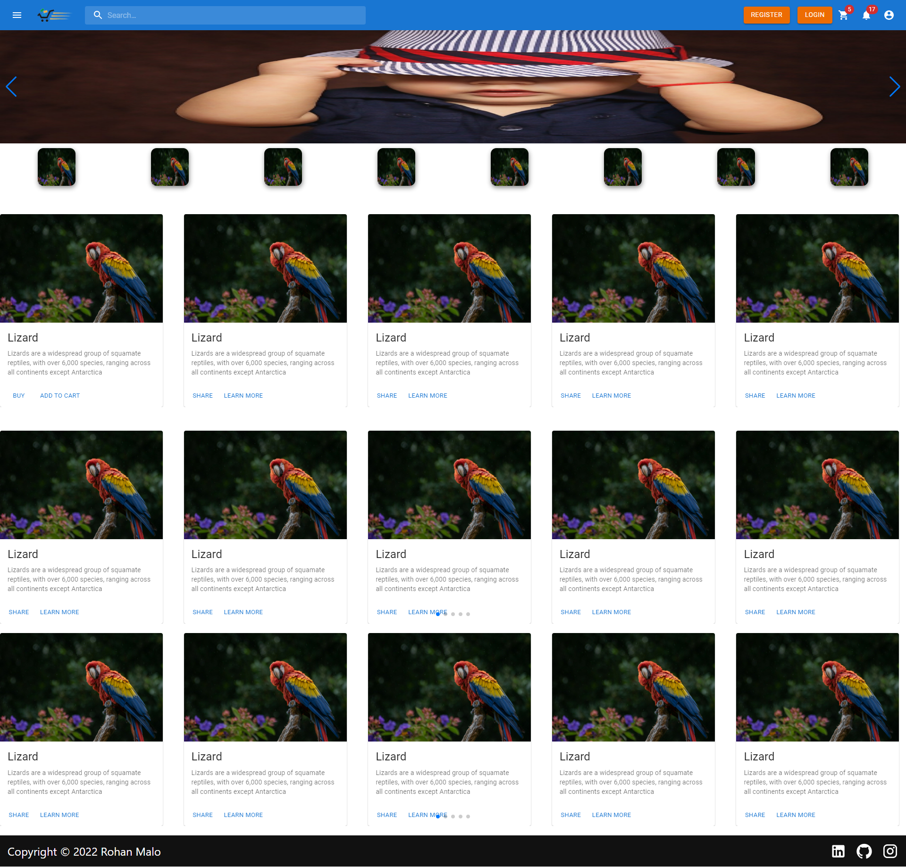

readme.so logo

dark
Download
SectionsReset

Delete
Click on a section below to edit the contents


Click on a section below to add it to your readme

Custom Section

Acknowledgements

Appendix

Authors

Badges

Color Reference

Contributing

Demo

Deployment

Documentation

Environment Variables

FAQ

Feedback

Github Profile - About Me

Github Profile - Introduction

Github Profile - Other

Github Profile - Skills

Lessons

License

Logo

Optimizations

Related

Roadmap

Run Locally

Support

Tech

Running Tests

Usage/Examples

Used By
Editor

## 🔗 Links

[](https://www.linkedin.com/in/rohan-malo-1bb400184/)
[](https://www.instagram.com/code.rohan127/)


Preview
Raw


# Ecommerce Desing in React

Frontend of an online Ecommerce Shop Desing


## Installation

Step by step Installation ( Super easy to install )

```bash
  git clone https://github.com/reo127/EcommerceDesign.git
  cd EcommerceDesign
  npm install
  npm start
```

## Features

- Login and Register
- Notification PopUp
- 8 Pages and 5 Components


## Pages

#### This site contains 8 pages 


| Pages |  Description                |
| :-------- | :------------------------- |
| `/` | **Home page** |
| `/pro` | **Product page, Hare user see a perticular Product** |
| `/category` | **Product separated by category** |
| `/profile` | **User Check and Eadit their Profile** |
| `/search` | **User Search Products** |
| `/billing` | **Conform order and make payment** |
| `/cart` | **User's Shopping Cart** |
| `/404ErrorPage` | **If a user tries to visit a page that does not exist Then a 404 error page comes** |


## Screenshots




## 🔗 Links

[](https://www.linkedin.com/in/rohan-malo-1bb400184/)
[](https://www.instagram.com/code.rohan127/)


readme.so
No results found for 'table'
